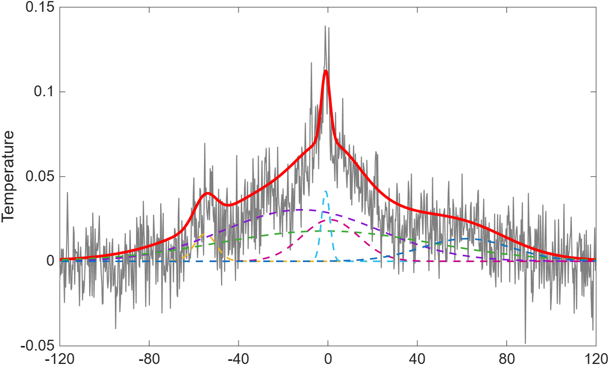

# Inferencia Bayesiana Paralela con MCMC

### Ajuste de mezclas gaussianas en señales experimentales

*High Performance Computing - HPCF*

**Autor:** Luis Eduardo Cardoso Paez
**Profesor:** Edwin Flórez Gómez
**Universidad de Puerto Rico**



---

## Resumen

En este proyecto hacemos uso de la Inferencia Bayesiana para la estimación de parámetros en señales astronómicas. Construimos un modelo de suma de picos gaussianos, que tenga como parámetro de entrada el número posibles picos, $k$, que pueda tener la señal. Para hacer esto, implementamos un algoritmo de Markov Chain Monte Carlo (MCMC) con el método de Metropolis-Hastings para estimar los parámetros de todos los $k$ picos gaussianos superpuestos con el ruido. Desde el enfoque de HPC usamos el paralelismo a nivel de tareas ejecutando 4 cadenas MCMC independientes simultáneamente en diferentes núcleos de la computadora o del clúster, esto permite una exploración eficiente del espacio de parámetros, mostrando si un pico detectado aparece en todas las cadenas. Finalmente, los resultados de todas las cadenas se combinan mediante un promedio para obtener una estimación general de los parámetros de cada pico.

---

## Descripción del Proyecto

El proyecto estima, a partir de un archivo CSV con una señal experimental, los parámetros de cada $k$ picos gaussianos. Estos parámetros son:

- **$A$** — Amplitud de cada pico, relacionada con la intensidad del gas.
- **$\mu$** — Centro (posición) de cada pico, relacionada con la velocidad a la que se mueve.
- **$\sigma$** — Ancho (desviación estándar) de cada pico, relacionado con la temperatura del gas.

El modelo asume la forma:

$$
y(x) = \sum_{i=1}^{k} A_i \cdot \exp\left( -\frac{(x - \mu_i)^2}{2\sigma_i^2} \right) + \varepsilon, \quad \varepsilon \sim \mathcal{N}(0, \sigma_{\text{ruido}}^2)
$$

Donde $k$ es la cantidad de picos que se cree que tiene la señal astronómica.

### Fundamento Bayesiano

La inferencia bayesiana se basa en el teorema de Bayes:

$$
P(\theta \mid \text{Datos}) = \frac{P(\text{Datos} \mid \theta) \cdot P(\theta)}{P(\text{Datos})}
$$

Aplicando logaritmo:

$$
\ln P(\theta \mid \text{Datos}) = \ln P(\text{Datos} \mid \theta) + \ln P(\theta) - \ln P(\text{Datos})
$$

Esta última ecuación es la que usaremos para hacer la inferencia, basados en el modelo que se describe a continuación.

#### Verosimilitud (Likelihood) — $P(\text{Datos} \mid \theta)$

La verosimilitud mide la capacidad del modelo para explicar los datos observados:

$$
\ln P(\text{Datos} \mid \theta) = -\frac{1}{2} \sum_{i} (y_i - \hat{y}_i)^2 \sigma^2
$$

Donde $y_i$ son los datos observados, $\hat{y}_i$ es el valor predicho por el modelo y $\sigma^2$ es la varianza del ruido.

#### Distribución a Priori — $P(\theta)$

La distribución a priori incorpora restricciones físicas y conocimiento previo del sistema:

$$
\begin{aligned}
A &> 0 \quad \text{(amplitud positiva)} \\
\sigma &> 0 \quad \text{(ancho positivo)} \\
\mu &\in [x_{\text{min}}, x_{\text{max}}] \quad \text{(centro dentro del rango de medición)}
\end{aligned}
$$

#### Distribución a Posteriori — $P(\theta \mid \text{Datos})$

La distribución a posteriori representa la probabilidad actualizada de los parámetros después de observar los datos:

$$
P(\theta \mid \text{Datos}) \propto \mathcal{L} \cdot \text{Prior}
$$

Es decir:

$$
\text{Posterior} \propto \text{Likelihood} \times \text{Prior}
$$

Esta distribución combina la información de los datos observados (verosimilitud) con el conocimiento previo (prior) para obtener una estimación más robusta de los parámetros.

---

## Tipo de Paralelismo

Para este proyecto usamos **Task Parallelism** (Paralelismo a nivel de tareas):

- Se ejecutan 4 cadenas MCMC independientes simultáneamente, cada una en un núcleo distinto del clúster o de la máquina local.
- Cada cadena usa una semilla aleatoria diferente (`seed = 1000 + chain_id`), garantizando exploración diversa del espacio de parámetros.
- Al finalizar, los resultados de cada cadena se combinan promediando.

| Núcleo | Cadena (seed) | Salida |
|---|---|---|
| Core 1 | Cadena 1 (seed=1001) | `result_chain_1.txt` |
| Core 2 | Cadena 2 (seed=1002) | `result_chain_2.txt` |
| Core 3 | Cadena 3 (seed=1003) | `result_chain_3.txt` |
| Core 4 | Cadena 4 (seed=1004) | `result_chain_4.txt` |

*Esquema de paralelización de cadenas MCMC*

### Ventajas sobre el modo lineal

- El tiempo de ejecución es similar al de 1 sola cadena.
- Mejor exploración del espacio de parámetros.
- Verificación de posibles picos para evitar falsos positivos.

---

## Archivos del Repositorio

Aunque se tienen señales astronómicas reales para poder realizar el experimento, **NO TENGO PERMITIDO COMPARTIR** estas señales hasta que las investigaciones que se están haciendo con ellas hayan concluido. Por tal motivo, podemos crear señales sintéticas para hacer el experimento. En el repositorio vamos a encontrar los siguientes archivos:

```bash
generar_senal.py        # Genera la senal sintetica con K picos gaussianos
bayes_parallel.py       # Algoritmo MCMC paralelo (una cadena por ejecucion)
analisis_cadenas.py     # Combina resultados y genera graficas
README.md               # Este archivo
```

La rutina `generar_senal.py` genera una señal sintética con $k$ picos gaussianos. En este caso, hay que ajustar los parámetros para cada pico en el programa; cuando lo ejecutamos, nos genera un archivo llamado `senal.csv` que va a ser el parámetro de entrada de `bayes_parallel.py`. En `bayes_parallel.py` está todo el modelo Bayesiano que se encarga de hacer la estimación de los parámetros, tiene como parámetros de entrada la señal, el número de picos $k$ y la cantidad de iteraciones del método MCMC. En `analisis_cadenas.py` combinamos los resultados y generamos las gráficas que se muestran en pantalla y previamente se guardan en la carpeta. El procedimiento para ejecutarlo se muestra a continuación.

---

## Cómo Ejecutarlo

Para poder ejecutar este programa, tenemos que tener instalado pandas. Si no está instalado, lo podemos hacer con:

```bash
pip install numpy pandas matplotlib scipy
```

### 1. Generar la señal sintética (opcional)

```bash
python generar_senal.py
```

Esto crea `senal.csv` con 3 picos gaussianos y ruido gaussiano ($\sigma=0.02$).

### 2. Ejecutar las cadenas MCMC en paralelo

#### En el clúster (Linux):

```bash
for id in 1 2 3 4; do
    python3 bayes_parallel.py --file senal.csv --K 3 --chain_id $id --n_iter 15000 &
done
wait
echo "todas las cadenas finalizadas"
```

#### En Windows (PowerShell / VS Code):

Los parámetros de entrada son la `senal.csv`, el número de picos $k=3$ y el número de iteraciones $n\_iter = 20000$.

```powershell
for %i in (1 2 3 4) do start python bayes_parallel.py --file senal.csv --K 3 --chain_id %i --n_iter 20000
```

Esto genera los archivos:

- `result_chain_1.txt`
- `result_chain_2.txt`
- `result_chain_3.txt`
- `result_chain_4.txt`

### 3. Analizar resultados y generar gráficas

```bash
python analisis_cadenas.py
```

Produce:

- Tabla en consola con los parámetros estimados vs valores reales y % de error.
- `analisis_cadenas.png` — Comparación de las 4 cadenas por parámetro.
- `senal_reconstruida.png` — Señal reconstruida vs señal original.

### 4. Descargar resultados del clúster (PSCP)

```bash
pscp lcardoso@boqueron.hpcf.upr.edu:/home/lcardoso/*.png C:\Users\profesor\Desktop\
pscp lcardoso@boqueron.hpcf.upr.edu:/home/lcardoso/*.txt C:\Users\profesor\Desktop\
```

---

## Parámetros del Algoritmo

| Parámetro | Valor | Descripción |
|---|---|---|
| `--file` | `senal.csv` | Archivo CSV con columnas x, y |
| `--K` | 3 | Número de picos gaussianos |
| `--chain_id` | 1-4 | ID de la cadena (define la semilla) |
| `--n_iter` | 20000 | Número de iteraciones MCMC |
| `sigma_noise` | 0.02 | Nivel de ruido de la señal |
| `burn_in` | 30% | Fracción descartada al inicio |

---

## Resultados Obtenidos

| Parámetro | Valor Real | Estimado | Error |
|---|---|---|---|
| $A_1$ | 0.3 | ~0.2639 | ~12% |
| $A_2$ | 0.2 | ~0.1950 | ~2.5% |
| $A_3$ | 0.1 | ~0.0872 | ~12% |
| $\mu_1$ | -80 | ~-80.0006 | ~0.00075% |
| $\mu_2$ | -5 | ~-5.1402 | ~2.8% |
| $\mu_3$ | 100 | ~99.8047 | ~0.19% |
| $\sigma_1$ | 2 | ~2.6271 | ~31% |
| $\sigma_2$ | 4 | ~4.2280 | ~5% |
| $\sigma_3$ | 3 | ~3.8433 | ~25% |

---

## Código Fuente

### `generar_senal.py`

```python
import math
import random
import csv


n_puntos = 10000
x_min = -200
x_max = 200
paso = (x_max - x_min) / (n_puntos - 1)


picos = [
    {"A": 0.2, "mu": -5, "sigma": 4},
    {"A": 0.3, "mu": -80, "sigma": 2},
    {"A": 0.1, "mu": 100, "sigma": 3}
]


nivel_ruido = 0.02
random.seed(42)  
nombre_archivo = "senal.csv"

with open(nombre_archivo, mode='w', newline='') as archivo_csv:
    escritor = csv.writer(archivo_csv)
    
    escritor.writerow(["X", "Senal_Limpia", "Senal_Con_Ruido"])
    
    for i in range(n_puntos):
        x = x_min + i * paso
        
        
        senal_limpia = 0.0
        for pico in picos:
            exponente = -((x - pico["mu"]) ** 2) / (2 * (pico["sigma"] ** 2))
            senal_limpia += pico["A"] * math.exp(exponente)
            
        
        ruido = random.gauss(0, nivel_ruido)
        senal_con_ruido = senal_limpia + ruido

        escritor.writerow([round(x, 4), round(senal_limpia, 4), round(senal_con_ruido, 4)])

print(f"¡Listo! Archivo '{nombre_archivo}' generado con éxito.")
print("Contiene 1000 puntos con picos en X=[2.5, 5.0, 7.5] y ruido moderado.")
```

### `bayes_parallel.py`

```python
import numpy as np
import matplotlib.pyplot as plt
from scipy.signal import find_peaks
import argparse
import pandas as pd
import sys

parser = argparse.ArgumentParser()
parser.add_argument("--file", type=str, required=True)
parser.add_argument("--K", type=int, required=True)
parser.add_argument("--chain_id", type=int, default=0)
parser.add_argument("--n_iter", type=int, default=15000)

args = parser.parse_args()
# Creamos una semilla diferente para cada cadena. porque daria el mismo resultado. 
np.random.seed(1000 + args.chain_id)

K = args.K
data = pd.read_csv(args.file)


try:
    col_x = [c for c in data.columns if c.lower() in ['x', 'tiempo_o_x', 'time', 'fre']][0]
    col_y = [c for c in data.columns if c.lower() in ['y', 'senal_con_ruido', 'temperature', 'amplitude']][0]

    x = data[col_x].values
    y = data[col_y].values
    print(f"[Cadena {args.chain_id}] Columnas detectadas con éxito -> X: '{col_x}', Y: '{col_y}'")
except IndexError:
    print(f" ERROR: No se pudieron mapear las columnas en '{args.file}'.")
    print(f"Columnas disponibles en tu archivo: {list(data.columns)}")
    sys.exit(1)

# =========================
# Modelos de suma de guassianas 
# =========================
def gaussian_mixture(x, A, mu, sigma):
    y_out = np.zeros_like(x)
    for Ai, mi, si in zip(A, mu, sigma):
        y_out += Ai * np.exp(-(x - mi)**2 / (2 * si**2))
    return y_out
# LIKELIHOOD
def log_likelihood(theta, x, y, K, sigma_noise):
    A     = theta[0:K]
    mu    = theta[K:2*K]
    sigma = theta[2*K:3*K]
    y_hat = gaussian_mixture(x, A, mu, sigma)
    return -0.5 * np.sum((y - y_hat)**2 / sigma_noise**2)

# PRIOR
def log_prior(theta, K, xmin, xmax):
    A     = theta[0:K]
    mu    = theta[K:2*K]
    sigma = theta[2*K:3*K]

    if np.any(sigma < 0.01):
        return -np.inf
    if np.any(mu < xmin) or np.any(mu > xmax):
        return -np.inf
    if np.any(A < 0):
        return -np.inf
    lp = 0
    lp -= np.sum((A/20)**2)
    lp -= np.sum((sigma/10)**2)
    return lp

# POSTERIOR
def log_posterior(theta, x, y, K, sigma_noise):
    xmin, xmax = np.min(x), np.max(x)
    lp = log_prior(theta, K, xmin, xmax)
    if not np.isfinite(lp):
        return -np.inf
    return lp + log_likelihood(theta, x, y, K, sigma_noise)


# ORDENAMIENTO


def sort_parameters(theta, K):
    A     = theta[0:K]
    mu    = theta[K:2*K]
    sigma = theta[2*K:3*K]
    idx   = np.argsort(mu)
    return np.concatenate([A[idx], mu[idx], sigma[idx]])


def initialize(x, y, K):
   
    #peaks, props = find_peaks(y, distance=50, height=0.05)
    peaks, props = find_peaks(y, distance=max(1, len(x)//(20*K)), height=np.max(y)*0.02)

    if len(peaks) >= K:
        
        top_idx = np.argsort(props["peak_heights"])[::-1][:K]
        peaks   = peaks[top_idx]
    else:
       
        peaks = np.linspace(0, len(x)-1, K).astype(int)

    A     = y[peaks]
    mu    = x[peaks]
    
    sigma = np.ones(K) * (x.max() - x.min()) / 100

    return np.concatenate([A, mu, sigma])


# =========================
# MCMC 
# =========================

def run_mcmc(x, y, K, n_iter=20000):
    sigma_noise = 0.02  #DEJAMOS EL RUIDO CONSNTANTE PARA ESTE EXPERIMENTO 
    theta_init = initialize(x, y, K)
    perturbacion = np.random.normal(0, 0.05, size=len(theta_init))
    theta = theta_init + perturbacion
    theta = sort_parameters(theta, K)

    current_lp  = log_posterior(theta, x, y, K, sigma_noise)

    samples = []
    accept  = 0

   
    rango      = x.max() - x.min()
    step_A     = 0.05          
    step_mu    = rango * 0.001  
    step_sigma = 0.05           

    steps = np.concatenate([
        np.ones(K) * step_A,
        np.ones(K) * step_mu,
        np.ones(K) * step_sigma
    ])

    for i in range(n_iter):
      
        proposal   = theta + np.random.normal(0, 1, size=len(theta)) * steps
        proposal   = sort_parameters(proposal, K)
        prop_lp    = log_posterior(proposal, x, y, K, sigma_noise)

        if np.log(np.random.rand()) < (prop_lp - current_lp):
            theta      = proposal
            current_lp = prop_lp
            accept    += 1

        samples.append(theta.copy())

        if i % 1000 == 0 and i > 0:
            print(f"[Cadena {args.chain_id}] Iter {i}/{n_iter}, Tasa de aceptación parcial: {accept/(i+1):.3f}")

    print(f"[Cadena {args.chain_id}] Finalizada. Tasa de aceptación final: {accept / n_iter:.3f}")
    return np.array(samples)


# RESULTADOS


def summarize(samples, K):
    burn_in = int(len(samples) * 0.3)
    mean    = np.mean(samples[burn_in:], axis=0)
    return mean[0:K], mean[K:2*K], mean[2*K:3*K]


if __name__ == "__main__":
    samples                  = run_mcmc(x, y, K, n_iter=args.n_iter)
    A_est, mu_est, sigma_est = summarize(samples, K)

    print(f"\n--- RESUMEN ESTIMACIONES CADENA {args.chain_id} ---")
    print("Amplitudes (A):   ", np.round(A_est, 4))
    print("Medias (mu):      ", np.round(mu_est, 4))
    print("Sigmas (sigma):   ", np.round(sigma_est, 4))

    out = np.concatenate([A_est, mu_est, sigma_est])
    np.savetxt(f"result_chain_{args.chain_id}.txt", out)
    print(f" Resultados consolidados en: result_chain_{args.chain_id}.txt\n")
```

### `analisis_cadenas.py`

```python
import numpy as np
import pandas as pd
import matplotlib.pyplot as plt
from scipy.signal import find_peaks

def leer_resultados_cadena(archivo, K):
    with open(archivo, 'r') as f:
        lines = f.readlines()
    params = []
    for line in lines[:K]:
        A, mu, sigma = map(float, line.strip().split())
        params.append([A, mu, sigma])
    return np.array(params)

def modelo_gaussiano(x, params):
    y = np.zeros_like(x)
    for A, mu, sigma in params:
        y += A * np.exp(-(x - mu)**2 / (2 * sigma**2))
    return y

def main():
    K = 3
    resultados_cadenas = []
    
    for chain_id in range(1, 5):
        params = leer_resultados_cadena(f'result_chain_{chain_id}.txt', K)
        resultados_cadenas.append(params)
    
    # Valores reales
    valores_reales = np.array([
        [10.0, 20.0, 2.0],
        [15.0, 50.0, 3.0],
        [12.0, 80.0, 1.5]
    ])
    
    # Promedio final
    promedio_final = np.mean(resultados_cadenas, axis=0)
    
    # Calcular errores
    print("\n" + "="*70)
    print("RESULTADOS FINALES - COMPARACIÓN CON VALORES REALES")
    print("="*70)
    print(f"{'Parámetro':<12} {'Real':<12} {'Estimado':<12} {'Error (%)':<12}")
    print("-"*70)
    
    for i in range(K):
        print(f"A{i+1}           {valores_reales[i,0]:<12.4f} {promedio_final[i,0]:<12.4f} {abs((promedio_final[i,0]-valores_reales[i,0])/valores_reales[i,0]*100):<12.2f}")
        print(f"mu{i+1}         {valores_reales[i,1]:<12.4f} {promedio_final[i,1]:<12.4f} {abs((promedio_final[i,1]-valores_reales[i,1])/valores_reales[i,1]*100):<12.2f}")
        print(f"sigma{i+1}       {valores_reales[i,2]:<12.4f} {promedio_final[i,2]:<12.4f} {abs((promedio_final[i,2]-valores_reales[i,2])/valores_reales[i,2]*100):<12.2f}")
        print("-"*70)
    
    # Graficar comparación de cadenas
    fig, axes = plt.subplots(3, 3, figsize=(15, 12))
    parametros = ['Amplitud (A)', 'Centro (μ)', 'Ancho (σ)']
    
    for i in range(K):
        for j, param_idx in enumerate([0, 1, 2]):
            ax = axes[i, j]
            valores_cadenas = [resultados_cadenas[chain][i, param_idx] for chain in range(4)]
            ax.bar(range(1, 5), valores_cadenas, alpha=0.7, label='Cadenas')
            ax.axhline(y=valores_reales[i, param_idx], color='r', linestyle='--', 
                      label=f'Real: {valores_reales[i, param_idx]:.2f}')
            ax.axhline(y=promedio_final[i, param_idx], color='g', linestyle='-', 
                      label=f'Promedio: {promedio_final[i, param_idx]:.2f}')
            ax.set_xlabel('Cadena')
            ax.set_ylabel(parametros[param_idx])
            ax.set_title(f'Pico {i+1} - {parametros[param_idx]}')
            ax.legend()
            ax.grid(True, alpha=0.3)
    
    plt.suptitle('Comparación de Cadenas MCMC por Parámetro', fontsize=16)
    plt.tight_layout()
    plt.savefig('analisis_cadenas.png', dpi=150)
    print("\n✓ Gráfica guardada: analisis_cadenas.png")
    
    # Reconstruir señal
    df = pd.read_csv('senal.csv')
    x = df['x'].values
    y_original = df['y'].values
    y_reconstruida = modelo_gaussiano(x, promedio_final)
    
    plt.figure(figsize=(12, 6))
    plt.plot(x, y_original, 'b-', alpha=0.7, label='Señal Original (con ruido)', linewidth=1)
    plt.plot(x, y_reconstruida, 'r-', label='Señal Reconstruida', linewidth=2)
    
    # Marcar picos
    for i in range(K):
        plt.axvline(x=promedio_final[i, 1], color='gray', linestyle=':', alpha=0.5)
        plt.text(promedio_final[i, 1], promedio_final[i, 0], 
                f'Pico {i+1}\nμ={promedio_final[i,1]:.1f}', 
                ha='center', va='bottom', fontsize=9)
    
    plt.xlabel('x')
    plt.ylabel('y')
    plt.title('Señal Reconstruida vs Señal Original')
    plt.legend()
    plt.grid(True, alpha=0.3)
    plt.savefig('senal_reconstruida.png', dpi=150)
    print("✓ Gráfica guardada: senal_reconstruida.png")
    
    plt.show()

if __name__ == "__main__":
    main()
```

---

## Conclusiones

En este proyecto se muestra exitosamente la implementación de un algoritmo MCMC paralelo para la inferencia bayesiana de parámetros con un modelo de suma de gaussianas. Las principales observaciones son:

- El paralelismo a nivel de tareas permite una exploración más eficiente del espacio de parámetros sin aumentar significativamente el tiempo de cómputo.
- Aunque el error de estimación en algunos parámetros fue alto, el método ha demostrado que es una alternativa viable para este tipo de problemas. Una de las posibles causas de este error es el alto ruido de la señal o una configuración más estricta en el prior.
- El uso de múltiples cadenas con diferentes semillas aleatorias permite verificar la convergencia de cada pico gaussiano, al mostrar todas las cadenas la detección del mismo pico.
- La implementación es escalable y puede adaptarse fácilmente para un número diferente de picos gaussianos.
